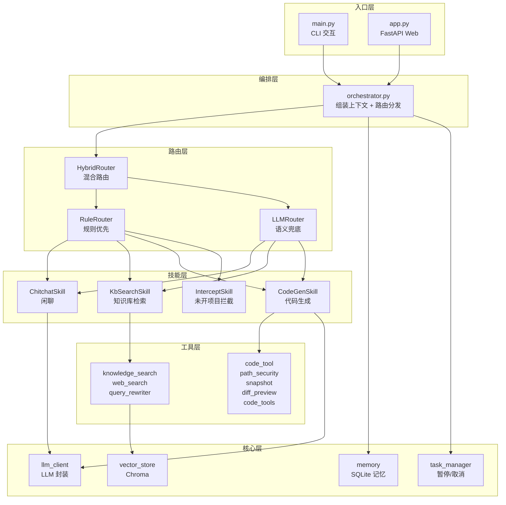
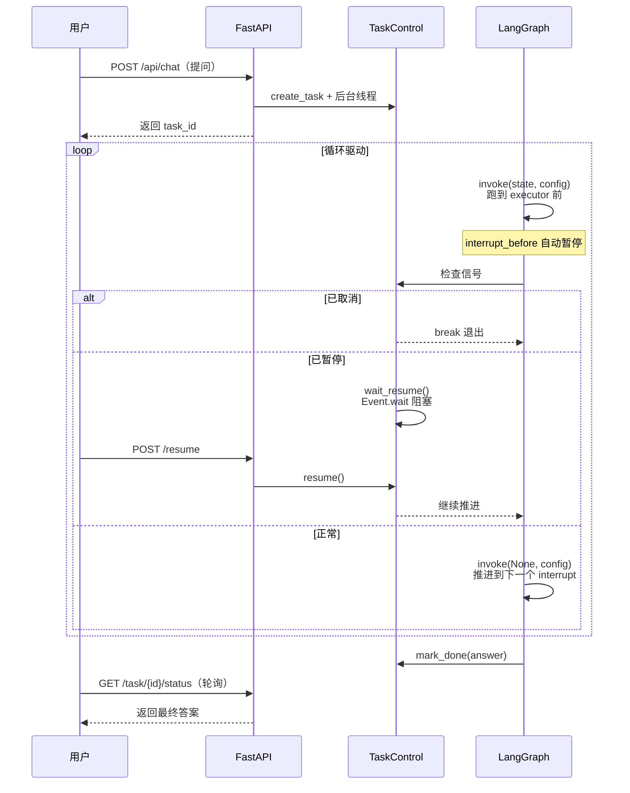

# AI 智能代码助手

基于 **LangGraph + Router + Skill 架构** 的智能问答与代码修改系统，支持知识库检索、项目代码读写、Diff 预览确认、任务暂停/取消。

## 核心特性

- **Router + Skill 分层架构**：规则路由优先 + LLM 语义兜底 + 代码拦截器，降低无效 LLM 调用
- **Plan-and-Execute + Reflexion 状态机**：基于 LangGraph 实现，含总步数/重规划/重试三重上限保护
- **混合检索**：向量检索（BGE）+ BM25 关键词检索 + RRF 融合排序
- **安全的代码读写**：三层白名单（内置 + 静态 + 会话动态）+ 黑名单二次校验，防止越权访问
- **自动快照 + 栈式撤销**：修改前自动备份，支持一键撤销
- **Diff 预览确认**：Agent 生成修改后先展示 diff，用户确认后才写入
- **任务暂停/继续/取消**：基于 LangGraph 原生 `interrupt_before` + MemorySaver，0ms 取消响应

## 架构图

### 整体分层架构



### CodeGenSkill 状态机


**四重保护**：
1. `MAX_CODE_ROUNDS`：总执行步数上限（默认 15）
2. `MAX_REPLAN_COUNT`：重规划次数上限
3. `MAX_RETRY_COUNT`：单步重试次数上限
4. JSON 解析失败 → 兜底 summarize

### 任务控制流程



## 快速启动

### 环境要求

- Python 3.11+
- 虚拟环境（推荐 venv / conda）

### 1. 克隆项目

```bash
git clone <your-repo-url>
cd RAG
```

### 2. 安装依赖

```bash
python -m venv .venv
# Windows
.venv\Scripts\activate
# Linux/Mac
source .venv/bin/activate

pip install -r requirements.txt
```

### 3. 配置环境变量

在 `simple/` 目录下创建 `.env` 文件：

```env
DASHSCOPE_API_KEY=your_dashscope_api_key_here
```

> 默认使用阿里云通义千问（DashScope OpenAI 兼容接口）。如需切换其他 OpenAI 兼容模型，修改 `config/config.py` 中的 `LLM_MODEL` 和 `LLM_BASE_URL`。

### 4. 构建知识库（首次运行）

将 PDF 文档放到 `simple/data/rag.pdf`，然后执行：

```bash
cd simple
python -m core.build_db
```

> 首次运行会自动下载 `BAAI/bge-small-zh-v1.5` Embedding 模型（约 100MB），需联网。Windows 网络受限时可设置 `EMBED_OFFLINE=True` 使用本地缓存。

### 5. 启动服务

#### Web 模式（推荐，完整功能）

```bash
cd simple
python main.py --web
```

访问 http://127.0.0.1:8000 即可使用。

API 文档：http://127.0.0.1:8000/docs

#### CLI 模式（仅问答，无代码修改功能）

```bash
cd simple
python main.py
```

## 目录结构

```
RAG/
├── requirements.txt          # 依赖清单
└── simple/                   # 项目主目录
    ├── main.py               # 入口：CLI / Web 模式切换
    ├── app.py                # FastAPI Web 服务（API 端点）
    ├── orchestrator.py       # 编排器（Router + Skill + Memory）
    ├── prompts.py            # 提示词模板
    ├── .env                  # 环境变量（API Key）
    │
    ├── config/               # 配置中心
    │   ├── config.py         # 所有路径/模型/阈值统一管理
    │   └── system_role.md    # 系统角色提示词
    │
    ├── core/                 # 核心层
    │   ├── llm_client.py     # LLM 调用封装
    │   ├── memory.py         # 对话记忆（SQLite）
    │   ├── task_manager.py   # 任务管理（暂停/继续/取消）
    │   ├── vector_store.py   # 向量检索（Chroma）
    │   └── build_db.py       # 知识库构建脚本
    │
    ├── router/               # 路由层
    │   ├── hybrid_router.py  # 混合路由（规则 + LLM）
    │   ├── rule_router.py    # 规则路由（can_handle 评分）
    │   └── llm_router.py     # LLM 语义路由
    │
    ├── skills/               # 技能层
    │   ├── base.py           # BaseSkill + SkillContext + check_task_control
    │   ├── chitchat.py       # 闲聊（问候/感谢/自我认知）
    │   ├── kb_search.py      # 知识库检索（向量 + BM25 + RRF）
    │   ├── code_gen.py       # 代码生成（LangGraph 状态机）
    │   └── intercept.py      # 未开项目拦截
    │
    ├── tools/                # 工具层
    │   ├── code_tool/        # 代码模块工具集（按职责拆分）
    │   │   ├── path_security.py   # 路径校验 + 三层白名单
    │   │   ├── snapshot.py        # 快照备份 + 栈式撤销
    │   │   ├── diff_preview.py    # Diff 预览 + 待确认修改
    │   │   ├── code_tools.py      # 工具实现 + @tool 装饰
    │   │   └── __init__.py        # 统一导出
    │   ├── knowledge_search.py    # 知识库检索工具
    │   ├── web_search.py          # 联网搜索工具
    │   ├── query_rewriter.py      # Query 改写工具
    │   └── weather_search.py      # 天气查询工具
    │
    ├── static/               # 前端静态资源
    │   └── index.html        # 三栏布局 + Monaco Editor
    │
    └── data/                 # 运行时数据
        ├── rag.pdf           # 知识库源文档
        ├── memory.db         # 对话记忆（SQLite）
        └── workspace/        # 工作区
            ├── uploads/      # 上传文件（按 session 隔离）
            └── history/      # 代码修改快照
```

## 核心配置说明

编辑 `simple/config/config.py` 可调整：

| 配置项 | 默认值 | 说明 |
|---|---|---|
| `LLM_MODEL` | `qwen3.7-max` | LLM 模型名 |
| `LLM_BASE_URL` | DashScope 兼容接口 | LLM API 地址 |
| `EMBED_MODEL_NAME` | `BAAI/bge-small-zh-v1.5` | Embedding 模型 |
| `ENABLE_CODE_AGENT` | `True` | 是否启用代码 Agent |
| `MAX_CODE_ROUNDS` | `15` | 状态机最大执行步数 |
| `ENABLE_MEMORY` | `True` | 是否启用对话记忆 |
| `MEMORY_BACKEND` | `sqlite` | 记忆后端（`memory`/`sqlite`） |
| `WEB_HOST` | `127.0.0.1` | Web 监听地址 |
| `WEB_PORT` | `8000` | Web 监听端口 |
| `ALLOWED_WORKSPACES` | `[]` | 静态白名单（默认空，靠打开项目动态扩展） |

## 主要 API

| 端点 | 方法 | 说明 |
|---|---|---|
| `/api/chat` | POST | 异步问答（返回 task_id） |
| `/api/task/{id}/status` | GET | 查询任务状态/进度 |
| `/api/task/{id}/pause` | POST | 暂停任务 |
| `/api/task/{id}/resume` | POST | 继续任务 |
| `/api/task/{id}/cancel` | POST | 取消任务 |
| `/api/workspace/open` | POST | 打开本地项目 |
| `/api/workspace/tree` | GET | 获取文件树 |
| `/api/workspace/file` | GET | 读取文件内容 |
| `/api/workspace/save` | POST | 保存文件（自动备份） |
| `/api/code/pending` | GET | 获取待确认的修改 |
| `/api/code/confirm` | POST | 确认执行修改 |
| `/api/code/cancel` | POST | 取消待确认的修改 |
| `/api/code/undo` | POST | 撤销最近一次修改 |
| `/api/code/history` | GET | 查询修改历史 |

完整 API 文档访问 `/docs`。

## 技术栈

| 类别 | 技术 |
|---|---|
| Agent 框架 | LangGraph |
| LLM 编排 | LangChain |
| LLM 模型 | 通义千问（DashScope OpenAI 兼容接口） |
| 向量数据库 | Chroma |
| Embedding | BAAI/bge-small-zh-v1.5 |
| 关键词检索 | rank-bm25 + jieba |
| Web 框架 | FastAPI + Uvicorn |
| 前端编辑器 | Monaco Editor |
| 记忆存储 | SQLite |
| 路径安全 | Path.resolve + 白名单/黑名单 |
