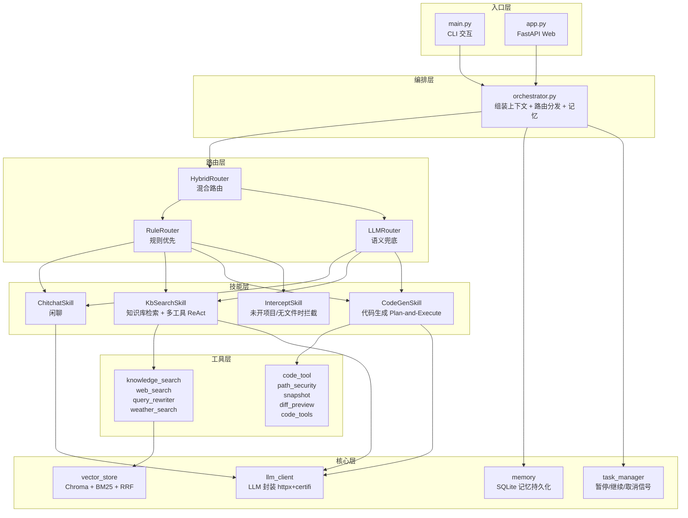
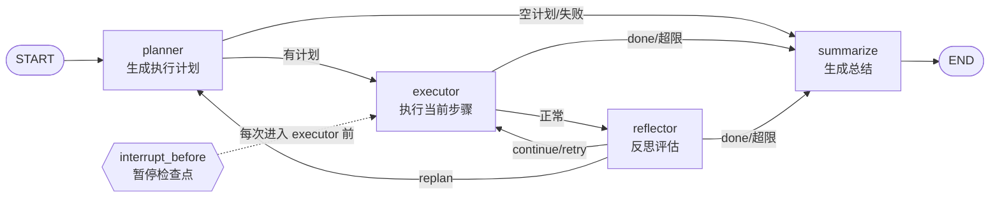

# AI 智能代码助手

基于 **LangGraph + Router + Skill 架构** 的智能问答与代码修改系统，支持知识库检索、联网搜索、天气查询、项目文件上传/打开/读写、Diff 预览确认、任务暂停/取消。

## 核心特性

- **Router + Skill 分层架构**：规则路由优先 + LLM 语义兜底 + 代码拦截器，降低无效 LLM 调用
- **Plan-and-Execute + Reflexion 状态机**：基于 LangGraph 实现，含总步数/重规划/重试三重上限保护
- **混合检索（Hybrid Search）**：向量检索（BGE）+ BM25 关键词检索 + RRF 融合排序
- **多工具能力**：知识库检索 / 联网搜索（`web_search`）/ 天气查询（`weather_search`）/ Query 改写
- **安全的代码读写**：五层安全防护
  1. 三层白名单（内置上传目录 + 静态配置 `ALLOWED_WORKSPACES` + 会话动态"打开项目" `add_session_workspace`）
  2. 黑名单二次校验（`BLOCKED_DIRS`：Windows/Program Files 等系统目录永不可达）
  3. **隐藏目录穿越过滤（NEW）**：`WORKSPACE_HIDDEN_DIRS` 共 15 类敏感目录名（`.venv / .git / __pycache__ / node_modules / .idea / .vscode / dist / build / egg-info / .pytest_cache / .mypy_cache / .ruff_cache / venv / .svn / .hg`），读/写/grep/list_dir/list_tree **五大入口全链路拦截**，即使用户打开的项目包含这些目录，Agent 也无法穿越读取或写入（防止改虚拟环境、读 git 凭据）
  4. **工具导出安全（NEW）**：`tools/` 与 `tools.code_tool` 两个包的公开导出只保留**必须显式传 `session_id` 的 `*_impl` 裸函数**；旧版 5 个不带 `session_id` 的 `@tool` 装饰版本（`read_file/edit_file/write_file/list_dir/grep_code`）已从 `from-import` 和 `__all__` 中移除，防止有人误用 `bind_tools` 导致"明明打开项目但路径一律不被允许"的故障
  5. `Path.resolve()` 规范化（防 `../` 跳转与符号链接绕过）
- **文件上传与工作区管理**：按 `session_id` 隔离上传文件；可动态"打开项目"绑定本地目录到白名单
- **自动快照 + 栈式撤销**：每次 edit/write 前自动备份，支持一键撤销与修改历史查询
- **Diff 预览确认**：Agent 生成修改后先展示 diff，用户确认后才写入磁盘
- **任务暂停/继续/取消**：基于 LangGraph 原生 `interrupt_before` + MemorySaver，取消信号 0ms 响应
- **多轮对话记忆**：SQLite 持久化 + 滑动窗口（默认每会话保留最近 20 条），重启不丢

## 架构图

### 整体分层架构



### CodeGenSkill 状态机



**四重保护**：
1. `MAX_CODE_ROUNDS`：总执行步数上限（默认 15）
2. `MAX_REPLAN_COUNT`：重规划次数上限
3. `MAX_RETRY_COUNT`：单步重试次数上限
4. JSON 解析失败 → 兜底 summarize 退出

### 任务控制流程


## 快速启动

### 环境要求

- Python **3.10+**（推荐 3.11）
- 虚拟环境（venv / conda 皆可）
- 阿里云 DashScope API Key（LLM 调用）

### 1. 克隆项目

```bash
git clone <your-repo-url>
cd CodingAgent
```

### 2. 安装依赖

```bash
python -m venv .venv

# Windows (PowerShell / CMD)
.venv\Scripts\activate
# Linux / macOS
source .venv/bin/activate

pip install -r requirements.txt
```

> **Windows 代理环境提示**：若遇到 `httpcore`/`httpx` SSL 证书验证失败，项目已通过 `certifi` 自动注入 CA 包；仍失败时可在 `.env` 中加 `LLM_SSL_VERIFY=False` 临时关闭验证。

### 3. 配置环境变量

在 `simple/` 目录下创建 `.env` 文件：

```env
# 必填：阿里云百炼 DashScope API Key
DASHSCOPE_API_KEY=sk-xxxxxxxxxxxxxxxxxxxxxxxx

# 可选：关闭 LLM SSL 证书验证（Windows 代理网络受限时使用）
# LLM_SSL_VERIFY=false
```

> 默认使用阿里云百炼 DashScope OpenAI 兼容接口，模型为 `qwen3.7-max`。如需切换到其他 OpenAI 兼容服务，修改 `simple/config/config.py` 中的 `LLM_MODEL` 和 `LLM_BASE_URL`。

### 4. 构建知识库（首次运行）

1. 将待入库的 PDF 文档放到 `simple/data/rag.pdf`
2. 执行向量库构建脚本：

```bash
cd simple
python -m core.build_db
```

> 首次运行会自动从 HuggingFace Hub 下载 `BAAI/bge-small-zh-v1.5` 中文 Embedding 模型（约 100MB），需联网。
>
> **Windows 网络受限 / HuggingFace 连接失败**：设置 `config.py` 中 `EMBED_OFFLINE = True`，强制从本地 `~/.cache/huggingface/hub/` 缓存加载（需首次成功下载过一次）。

### 5. 启动服务

#### Web 模式（推荐，完整功能）

```bash
cd simple
python main.py --web
```

- 前端界面：http://127.0.0.1:8000
- API 文档（Swagger UI）：http://127.0.0.1:8000/docs
- 健康检查：http://127.0.0.1:8000/api/health

#### CLI 模式（问答 + 引用片段，无代码修改）

```bash
cd simple
python main.py
```

输入 `exit` 退出。CLI 模式固定使用 `session_id="cli-default"`，同一终端内多轮有记忆。

## 目录结构

```
CodingAgent/
├── requirements.txt              # 完整依赖清单（pip freeze 锁定版本，115 项含所有传递依赖，确保可复现）
├── README.md                     # 本文档
└── simple/                       # 项目源码主目录
    ├── main.py                   # 入口：CLI / Web 模式切换（--web 开关）
    ├── app.py                    # FastAPI Web 服务（21 个 API 端点，Swagger 标题：RAG 智能问答助手）
    ├── orchestrator.py           # 编排器：组装 Memory + Router + Skill，统一 query 入口
    ├── prompts.py                # 所有 LLM 提示词模板（ReAct/Planner/Reflector 等）
    ├── .env                      # 环境变量（DASHSCOPE_API_KEY、LLM_SSL_VERIFY 等）
    │
    ├── config/                   # 配置中心（零硬编码，所有常量集中管理）
    │   ├── config.py             # 路径/模型/阈值/检索/记忆/代码/上传/隐藏目录过滤 全部配置（40+ 项）
    │   └── system_role.md        # 系统角色提示词（启动加载，支持热重载）
    │
    ├── core/                     # 核心层
    │   ├── llm_client.py         # LLM 封装：httpx+certifi，ChatOpenAI（DashScope 兼容）
    │   ├── memory.py             # 对话记忆：抽象层 + Memory(内存) / SQLite(持久化) 双后端
    │   ├── task_manager.py       # 任务管理：线程池 + Event，暂停/继续/取消信号
    │   ├── vector_store.py       # 混合检索：Chroma 向量 + BM25 关键词 + RRF 融合排序
    │   ├── build_db.py           # 知识库构建脚本（CLI：python -m core.build_db）
    │   └── utils.py              # 通用工具（JSON 解析兜底 / Query 改写）
    │
    ├── router/                   # 路由层（混合路由）
    │   ├── hybrid_router.py      # 入口：规则优先 → 代码拦截 → LLM 兜底 → KbSearch 再兜底
    │   ├── rule_router.py        # 规则路由：关键词/正则快速分类，零 LLM 开销
    │   └── llm_router.py         # LLM 语义路由：规则未命中场景的分类兜底
    │
    ├── skills/                   # 技能层（Skill 模式）
    │   ├── base.py               # BaseSkill + SkillContext + check_task_control 公共逻辑
    │   ├── chitchat.py           # 闲聊技能：问候/感谢/自我认知等寒暄
    │   ├── kb_search.py          # 知识库技能：Query 改写 + 多轮 ReAct（KB+Web+Weather）
    │   ├── code_gen.py           # 代码技能：LangGraph Plan-and-Execute + Reflexion 状态机（含 MAX_REPLAN_COUNT=3 / MAX_RETRY_COUNT=2 常量）
    │   └── intercept.py          # 拦截技能：代码类问题但无可用文件时，引导用户打开项目/上传
    │
    ├── tools/                    # 工具层（⚠️ 公开导出仅保留必须传 session_id 的 *_impl 裸函数）
    │   ├── code_tool/            # 代码模块工具集（按职责拆分，避免单文件 2000 行）
    │   │   ├── path_security.py      # 路径安全：Path.resolve + 三层白名单 + 隐藏目录穿越过滤 + 黑名单
    │   │   ├── snapshot.py           # 快照备份：write/edit 前自动备份，栈式撤销
    │   │   ├── diff_preview.py       # Diff 预览：生成待确认修改 + 用户确认/取消
    │   │   ├── code_tools.py         # 工具实现：裸函数 *_impl（会话安全）+ 内部保留的 @tool 版本（未对外公开导出）
    │   │   └── __init__.py           # 统一导出：会话白名单管理 + 安全裸函数（移除了 5 个无 session_id 的 @tool）
    │   ├── knowledge_search.py   # 知识库检索工具：混合搜索（向量+BM25+RRF）
    │   ├── web_search.py         # 联网搜索工具：搜索引擎 + 网页正文抓取截断
    │   ├── query_rewriter.py     # Query 改写工具：口语化问题 → 检索友好表述
    │   └── weather_search.py     # 天气查询工具：实时天气 / 多日预报
    │
    ├── static/                   # 前端静态资源
    │   └── index.html            # 三栏布局：对话区 + 文件树 + Monaco Editor 代码预览
    │
    ├── db/                       # Chroma 向量库持久化目录（build_db 后自动生成，路径=VECTOR_DB_PATH）
    └── data/                     # 运行时数据目录（.gitignore 已忽略）
        ├── rag.pdf               # 知识库源文档（PDF，入库用）
        ├── memory.db             # 对话记忆 SQLite 数据库（MEMORY_BACKEND=sqlite 时自动生成）
        └── workspace/            # 工作区
            ├── uploads/          # 上传文件：按 session_id 隔离子目录
            └── history/          # 代码修改快照：每次 write/edit 前自动 timestamp 备份
```

## 核心配置说明

编辑 `simple/config/config.py` 调整，**修改后需重启服务生效**：

### LLM 与 Embedding

| 配置项 | 默认值 | 说明 |
|---|---|---|
| `VECTOR_DB_PATH` | `./db` | Chroma 向量库持久化根目录（相对 `simple/`） |
| `LLM_MODEL` | `qwen3.7-max` | LLM 模型名（阿里云百炼 DashScope） |
| `LLM_BASE_URL` | `https://dashscope.aliyuncs.com/compatible-mode/v1` | OpenAI 兼容 API 基地址 |
| `LLM_TEMPERATURE` | `0.0` | 生成温度（代码/检索场景建议 0） |
| `EMBED_MODEL_NAME` | `BAAI/bge-small-zh-v1.5` | 中文 Embedding 模型（HuggingFace） |
| `EMBED_DEVICE` | `cpu` | Embedding 推理设备：`cpu` / `cuda` / `mps` |
| `EMBED_NORMALIZE` | `True` | BGE 向量归一化开关（**必须开**，否则相似度范围错乱） |
| `EMBED_OFFLINE` | `True` | Embedding 离线模式（Win 网络受限时开；强制走本地缓存不联网） |
| `EMBED_CACHE_DIR` | `None` | HuggingFace 本地缓存目录；`None`=默认 `~/.cache/huggingface/`，可填绝对路径自定义 |
| `SYSTEM_ROLE_FILE` | `./config/system_role.md` | 系统角色提示词文件路径 |

### 文档切分（中文语义优先）

| 配置项 | 默认值 | 说明 |
|---|---|---|
| `CHUNK_SIZE` | `500` | 文档切分单块最大字符数 |
| `CHUNK_OVERLAP` | `100` | 相邻块重叠字符数 |
| `CHUNK_SEPARATORS` | `["\n\n", "\n", "。", "！", "？", "；", "，", " ", ""]` | 语义切分分隔符（按优先级从段落→句号→逗号→字符逐级尝试，避免硬切句中） |

### 检索与混合搜索

| 配置项 | 默认值 | 说明 |
|---|---|---|
| `RETRIEVE_TOP_K` | `8` | 向量检索召回条数 |
| `SIMILARITY_THRESHOLD` | `1.0` | L2 距离阈值（越大越宽松，BGE 范围 0~2；距离≈1.0≈余弦 0.5） |
| `ENABLE_HYBRID_SEARCH` | `True` | 启用混合检索：向量 + BM25 + RRF 融合 |
| `BM25_TOP_K` | `10` | BM25 关键词检索召回条数 |
| `RRF_K` | `60` | RRF 融合常数（标准值 60，越大越均衡） |

### RAG 流程

| 配置项 | 默认值 | 说明 |
|---|---|---|
| `ENABLE_MULTI_ROUND` | `True` | 启用 ReAct 多轮检索（否则单轮直接答） |
| `MAX_SEARCH_ROUND` | `5` | ReAct 检索最大轮次 |
| `ENABLE_QUERY_REWRITE` | `True` | 启用首轮 Query 改写（口语→检索友好） |
| `ENABLE_WEB_SEARCH` | `True` | 启用联网搜索（本地搜不到时兜底） |
| `WEB_SEARCH_MAX_RESULTS` | `3` | 联网搜索最大返回结果数 |
| `WEB_FETCH_TIMEOUT` | `8` | 网页抓取超时秒 |
| `WEB_CONTENT_MAX_CHARS` | `800` | 单网页正文最大保留字符 |

### 记忆与对话

| 配置项 | 默认值 | 说明 |
|---|---|---|
| `ENABLE_MEMORY` | `True` | 启用多轮对话记忆 |
| `MEMORY_BACKEND` | `sqlite` | 记忆后端：`memory`(内存/重启丢) / `sqlite`(持久化) |
| `MEMORY_DB_PATH` | `./data/memory.db` | SQLite 记忆数据库路径 |
| `MEMORY_MAX_MESSAGES` | `20` | 每会话滑动窗口最大消息数 |

### 代码 Agent

| 配置项 | 默认值 | 说明 |
|---|---|---|
| `ENABLE_CODE_AGENT` | `True` | 启用代码 Agent（关闭后代码类问题被拦截器直接拒绝） |
| `MAX_CODE_ROUNDS` | `15` | LangGraph 状态机**总步数上限**（防死循环；重规划会重置，给新计划完整额度） |
| `MAX_REPLAN_COUNT` | `3` | **重规划次数上限**（硬编码在 `skills/code_gen.py#L61`；超过后强制总结退出） |
| `MAX_RETRY_COUNT` | `2` | **单步重试次数上限**（硬编码在 `skills/code_gen.py#L62`；超过后转为 replan） |
| `CODE_HISTORY_DIR` | `./data/workspace/history` | 代码修改快照目录（每次 write/edit 前自动备份） |
| `ALLOWED_WORKSPACES` | `[]` | 静态永久白名单目录（默认空，推荐靠运行时「打开项目」动态绑定） |
| `BLOCKED_DIRS` | `["C:\\Windows", ...]` | 黑名单目录（永不可达，即使恰好命中白名单） |
| `WORKSPACE_HIDDEN_DIRS` | 15 项集合 | **隐藏目录穿越过滤名单**（`.venv/.git/__pycache__/node_modules/.idea/.vscode/dist/build/egg-info/.pytest_cache/.mypy_cache/.ruff_cache/venv/.svn/.hg`），读/写/grep/list_dir/list_tree 五大入口全链路拦截；命中时返回「禁止访问隐藏目录/文件: {path}（命中敏感目录: {name}）」 |
| `WORKSPACE_ALLOWED_ROOTS` | `[]` | 「打开项目」前缀限制；非空时只允许绑定这些根目录下的子目录（例：`["C:\\Users","D:\\","/home"]`，默认空=不限制） |
| `WORKSPACE_MAX_PROJECTS` | `3` | 单会话最多同时打开的项目数 |
| `WORKSPACE_TREE_DEFAULT_DEPTH` | `2` | 文件树懒加载默认深度 |
| `WORKSPACE_TREE_MAX_DEPTH` | `5` | 文件树最大深度（防递归爆栈） |

### 文件上传

| 配置项 | 默认值 | 说明 |
|---|---|---|
| `UPLOAD_DIR` | `./data/workspace/uploads` | 上传文件根目录（按 `session_id` 自动隔离子目录） |
| `UPLOAD_MAX_FILE_SIZE` | `1 * 1024 * 1024` | 单文件大小上限：1MB（字节） |
| `UPLOAD_MAX_SESSION_SIZE` | `10 * 1024 * 1024` | 单会话总大小上限：10MB（字节） |
| `UPLOAD_ALLOWED_EXTS` | 35 种扩展名集合 | 允许上传的文件白名单（`.py/.js/.ts/.java/.go/.rs/.md/.json/.yaml/.sql/.sh` 等全部代码/文本类，不允许二进制/可执行） |

### Web 服务

| 配置项 | 默认值 | 说明 |
|---|---|---|
| `WEB_HOST` | `127.0.0.1` | Web 监听地址（局域网访问改 `0.0.0.0`） |
| `WEB_PORT` | `8000` | Web 监听端口 |

## 主要 API 列表

启动后访问 **http://127.0.0.1:8000/docs** 查看完整 Swagger 文档（含请求/响应示例、可在线调试）。

### 系统与健康

| 端点 | 方法 | 说明 |
|---|---|---|
| `/` | GET | 返回前端界面 `static/index.html` |
| `/api/health` | GET | 健康检查，返回 `{status, mode}` |

### 问答与任务控制

| 端点 | 方法 | 说明 |
|---|---|---|
| `/api/chat` | POST | 异步问答（创建后台任务，立即返回 `task_id`） |
| `/api/task/{task_id}/status` | GET | 查询任务状态/进度/最终答案（轮询接口） |
| `/api/task/{task_id}/pause` | POST | 暂停执行中任务 |
| `/api/task/{task_id}/resume` | POST | 继续已暂停任务 |
| `/api/task/{task_id}/cancel` | POST | 立即取消任务（0ms 响应中断信号） |

### 代码修改（确认流 + 撤销）

| 端点 | 方法 | 说明 |
|---|---|---|
| `/api/code/pending` | GET | 获取待用户确认的 Diff 修改列表 |
| `/api/code/confirm` | POST | 确认执行待修改（写入磁盘，自动创建快照） |
| `/api/code/cancel` | POST | 取消待确认修改（丢弃 Diff，不写盘） |
| `/api/code/undo` | POST | 撤销最近一次已确认修改（回滚快照） |
| `/api/code/history` | GET | 查询指定文件的修改历史快照列表 |

### 文件上传

| 端点 | 方法 | 说明 |
|---|---|---|
| `/api/code/upload` | POST | 上传代码/文本文件（按 `session_id` 隔离，加入白名单） |
| `/api/code/uploads/{session_id}` | GET | 列出指定会话的已上传文件列表 |
| `/api/code/uploads/{session_id}/{filename}` | DELETE | 删除指定上传文件（同步从白名单移除） |

### 工作区（打开本地项目）

| 端点 | 方法 | 说明 |
|---|---|---|
| `/api/workspace/open` | POST | 打开本地项目目录（加入会话级白名单） |
| `/api/workspace/close` | POST | 关闭已打开项目（从白名单移除） |
| `/api/workspace/status` | GET | 查询当前会话已打开/已上传的工作区状态 |
| `/api/workspace/tree` | GET | 获取指定根目录的文件树（懒加载，可控深度） |
| `/api/workspace/file` | GET | 读取工作区文件内容（白名单校验） |
| `/api/workspace/save` | POST | 保存工作区文件（自动创建快照，支持后续撤销） |

## 技术栈

| 类别 | 技术 / 库 | 版本（已锁定，与 requirements.txt 一致） |
|---|---|---|
| Agent 状态机框架 | **LangGraph** | `langgraph==1.2.11`（含 `langgraph-checkpoint==4.2.0`） |
| LLM 编排 / Tool / Document | **LangChain** 生态 | `langchain-core==1.5.6` / `langchain-community==0.4.2` / `langchain-text-splitters==1.1.2` / `langchain-classic==1.0.8` |
| LLM API 适配 | **langchain-openai**（ChatOpenAI 兼容模式） | `langchain-openai==1.5.2` |
| LLM 模型 | 阿里云百炼 DashScope **qwen3.7-max** | — |
| LLM HTTP 客户端 | **httpx** + **certifi**（SSL CA 证书注入） | `httpx==0.28.1` / `certifi==2026.7.22` |
| 向量数据库 | **Chroma**（本地持久化 + langchain-chroma 适配） | `chromadb==1.5.9` / `langchain-chroma==1.1.0` |
| Embedding | **BAAI/bge-small-zh-v1.5**（langchain-huggingface + sentence-transformers） | `langchain-huggingface==1.2.2` / `huggingface_hub==1.28.0` |
| 关键词检索 | **rank-bm25**（Okapi BM25）+ **jieba** 中文分词（通过 langchain-classic 传递依赖引入） | — |
| 文档加载 | **PyPDFLoader**（pypdf，通过 langchain-community 传递依赖引入） | — |
| 环境变量加载 | **python-dotenv**（`.env` 文件） | `python-dotenv==1.2.3` |
| Web 框架 | **FastAPI**（**Pydantic v2** 数据校验 + `python-multipart` 文件上传） | `fastapi==0.141.1` / `pydantic==2.13.4` / `python-multipart==0.0.32` |
| ASGI 服务器 | **Uvicorn**（HTTP/WS） | `uvicorn==0.52.4` |
| 前端编辑器 | **Monaco Editor**（VS Code 同款，CDN 加载） | — |
| 记忆存储 | **SQLite 3**（Python 标准库 `sqlite3`，零额外安装） | — |
| 路径安全（5 层） | `Path.resolve()` 规范化 + 三层白名单（内置/静态/会话）+ **隐藏目录组件过滤（WORKSPACE_HIDDEN_DIRS，15 类）** + **工具导出会话安全（公开仅保留 *_impl）** + BLOCKED_DIRS 黑名单双保险 | — |
| HTTP 请求（工具侧） | **requests**（weather_search / web_search） | `requests==2.34.2` |
| Markdown 解析（工具侧） | **markdown-it-py**（结构化渲染网页正文片段） | `markdown-it-py==4.2.0` |

完整依赖清单见 [requirements.txt](file:///d:/python/CodingAgent/requirements.txt)（pip freeze 锁定，115 项含所有传递依赖，可复现安装）。

## 常见问题

### Q1: Windows 下首次运行报 `WinError 10060` 连接超时？
A：HuggingFace Embedding 模型下载受阻。解决方案：
1. 开代理后重试一次下载成功；
2. 之后把 `config.py` 的 `EMBED_OFFLINE = True` 打开，后续全部走本地缓存。

### Q2: 提示 "未打开项目，无法修改代码"？
A：这是 **InterceptSkill** 的安全拦截，避免 Agent 空跑浪费 LLM。在前端点击"打开项目"选择本地目录，或用 `/api/code/upload` 上传文件后即可正常使用代码修改功能。

### Q3: 如何彻底禁止代码能力？
A：把 `config.py` 中 `ENABLE_CODE_AGENT = False`，所有代码类问题会被路由拦截器直接拒绝并给出提示。

### Q4: 修改了 system_role.md 为什么不生效？
A：文件只在程序启动时读取一次。两种方式生效：
1. 重启服务；
2. 调用 `core/llm_client.py` 中 `reload_system_role()` 热重载接口。

### Q5: Agent 报错 "禁止访问隐藏目录/文件: xxx（命中敏感目录: .venv/.git/...）" 怎么办？
A：这是**隐藏目录穿越过滤**（第五层安全防护，基于 `WORKSPACE_HIDDEN_DIRS`）的正常行为。只要用户打开的项目路径中任何一段匹配了 15 类敏感目录名（`.venv / .git / __pycache__ / node_modules / .idea / .vscode / dist / build / egg-info / .pytest_cache / .mypy_cache / .ruff_cache / venv / .svn / .hg`），读/写/grep/list_dir/list_tree 五大入口都会拦截（防止修改虚拟环境、泄露 git 凭据、遍历 node_modules 污染结果）。正常做法是让 Agent 把代码生成/修改放到打开项目根下的业务源码目录中（如 `src/`、`app/`），而不是进入这些环境目录。

### Q6: 明明在前端"打开了项目"，但代码工具调用返回 "路径不在允许的工作区内"？
A：**最大概率是误用了未传 `session_id` 的工具调用方式**。项目为了杜绝此类 bug（Bug 2 已修复），已从 `tools/__init__.py` 与 `tools.code_tool.__init__.py` 的公开导出（from-import + `__all__`）中移除了 5 个不带 `session_id` 参数的 `@tool` 装饰版本（`read_file / edit_file / write_file / list_dir / grep_code`）。正确做法：
- 新代码必须使用 `read_file_impl(filepath, session_id=...)` 等 `*_impl` 裸函数（可从 `tools` 或 `tools.code_tool` 包直接 `import`），并显式传入当前请求的 `session_id`；
- 如果要用 `bind_tools` 对接 LLM，必须在 `Skill.execute` 内部用闭包把当前会话的 `session_id` 注入到工具签名中（不要复用全局静态工具）。
- 第二种可能：`session_id` 不一致。确保「打开项目」POST `/api/workspace/open` 带的 `session_id` 与后续 POST `/api/chat`、GET `/api/code/pending`、POST `/api/code/confirm` 等接口**传的是同一个**（浏览器 DevTools → Network → Query / Body 核对）。
